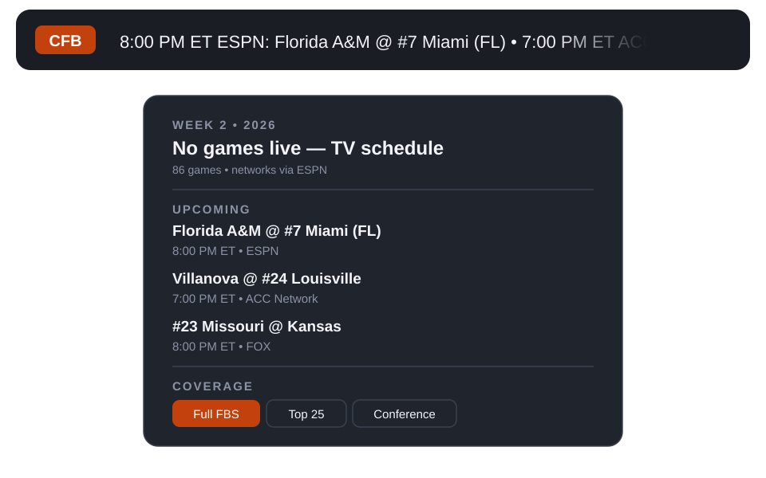

# Football Ticker

Scrolling live college football and NFL scores for the Omarchy bar.
When no games are live, it scrolls the upcoming TV schedule instead,
plus weekly fantasy football leaders.



## Status
Verified live Sept 2026: NCAAF Week 2 (86 games, 86/86 with TV networks),
NFL Week 1 (15 games incl. live Thu opener), fantasy leaders from Sleeper.

## Install
```sh
omarchy plugin add https://github.com/Primly/ncaaf-ticker.git --enable
# or, from this folder:
omarchy-shell shell rescanPlugins && omarchy plugin enable primly.ncaaf-ticker --section center
```

## Usage
- Ticker scrolls live scores, or the TV schedule when nothing is live.
- Left-click opens the panel: league toggle (NCAAF | NFL), game lists
  (Live / Upcoming / Finals), coverage filters, and — for NFL — weekly
  fantasy leaders by position with switchable PPR / Half-PPR / Standard
  scoring. Changes apply instantly and persist to `shell.json`.
- Right/middle-click forces a refresh. Hover pauses scrolling + shows tooltip.

## Configure (panel or CLI)
```sh
omarchy bar move primly.ncaaf-ticker --section center
omarchy bar set primly.ncaaf-ticker league NFL
omarchy bar set primly.ncaaf-ticker tickerMode Both
omarchy bar set primly.ncaaf-ticker nflScope Division
omarchy bar set primly.ncaaf-ticker nflDivision nfc-west
omarchy bar set primly.ncaaf-ticker fantasyScoring Half-PPR
omarchy bar set primly.ncaaf-ticker scope "Top 25"
omarchy bar set primly.ncaaf-ticker scrollSpeed 60
```
Leagues: `NCAAF`, `NFL`. NFL ticker modes: `Scores`, `Fantasy`, `Both`.
College scopes: `Full FBS`, `Top 25`, `Conference` (+ `conference` slug).
NFL scopes: `All NFL`, `Division` (+ `nflDivision`: `afc/nfc-east/north/south/west`).

## Data sources (no API key)
1. NCAA scoreboard (`ncaa-api.henrygd.me` live scrape, `data.ncaa.com`
   archive fallback) — college scores, states, kickoffs. The S3 archive
   lags the current season; the public demo proxy is ~5 req/s (we poll 60s).
2. ESPN (`site.web.api.espn.com` scoreboard) — NCAA TV-network enrichment
   (86/86 Week 2) and all NFL scores/schedules/networks. Note the
   `site.api.espn.com` host is Akamai-blocked (403); `site.web` serves the
   same JSON.
3. Sleeper (`api.sleeper.app` state = authoritative NFL week;
   `api.sleeper.com` stats = weekly fantasy points by position; note the
   stats live on `.com`, the `.app` host returns empty shells). Current-week
   leaders with fallback to the previous week; cached 10 min per week.
4. Last-good responses cached under `~/.cache/primly.*`.

Self-host the NCAA proxy for reliability:
```sh
docker run --rm -p 3000:3000 henrygd/ncaa-api
NCAA_API_BASE=http://localhost:3000 python3 scripts/ncaaf.py fetch
```

## Remove
```sh
omarchy plugin remove primly.ncaaf-ticker
```
